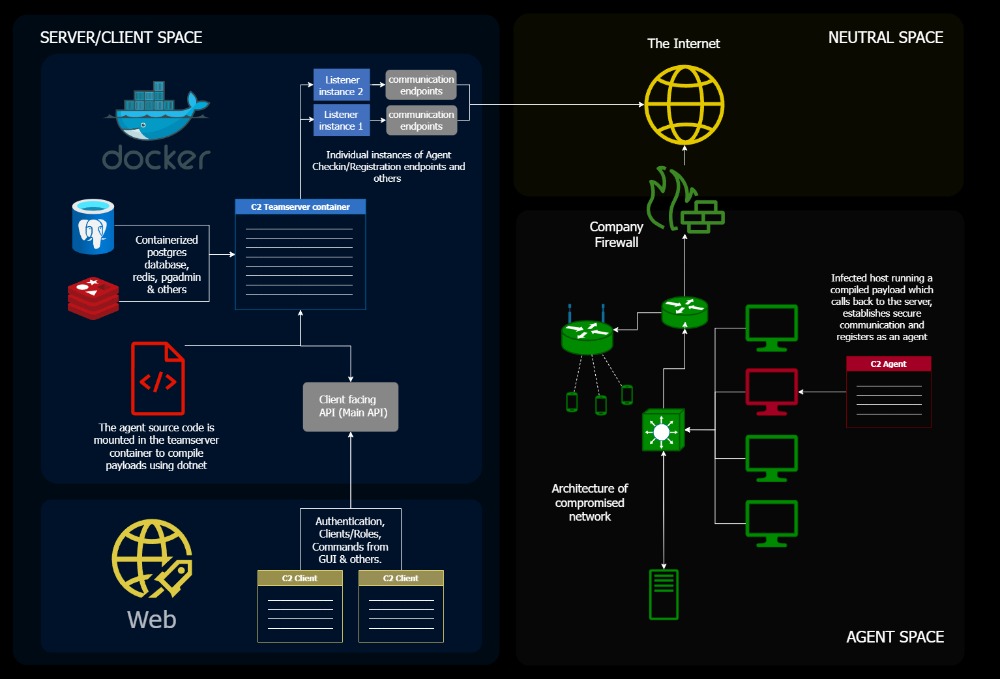

# Welcome to the documentation for Meduza C2

Meduza is a modular, collaborative Command and Control (C2) framework developed using Golang for the teamserver, C# for the base agent, and ReactJS for the client. It is designed to be modular and adaptable with easy to swap interchangeable components.

## Key Features

- **Modular Design:** Meduza's architecture is designed to support components from many codebases and a variety of different functions making it ideal for the end user to adjust for personal preference and requirements.
- **Collaborative Environment:** The project is made with collaboration in mind, making team-based work easier by having a built-in chat feature and teams.
- **Containerized and easy-to-deploy framework:** One of Meduza's main features is that it's containerized, allowing quick and scalable deployments with no issues involving system support.
- **Intuitive and easy to navigate user interface:** Slick UI client coded in React.
- **Modular listeners:** As mentioned prior, listeners are modular. They include external and local deployments, making it possible to deploy listeners of any type.
- **Modular payloads/agents:** Modular loading of payloads including parameters for user interface for easy access and compilation of agents directly from the client.
- **Agent modules:** Agent modules for dynamic loading of assemblies and their dependencies during runtime (for C# agents only for now).
- **Built-in MITRE ATT&CK graph:** MITRE ATT&CK graph providing easy access to adversary tactics and techniques.
- **Jupyter notebook:** A container running Jupyter notebook for scripting.

To get started with Meduza, follow these steps:

## Getting Started

1. **Installation:** To install Meduza on your system: [installation guide](installation.md).
2. **Configuration:** To configure Meduza: [configuration guide](configuration.md).
3. **Usage:** For an in-depth dive on the usage of Meduza: [usage guide](usage.md).

## Contributing
Meduza is an open-source project. Any contributions are more than welcome. If you would like to contribute please check out the following:
- Our [contribution guidelines](contributing.md).
- The [issues](https://github.com/ksel172/Meduza/issues) on our GitHub repository.

**For more information**: 
 - [Meduza GitHub repository](https://github.com/ksel172/Meduza).
 - Contact me at: [@KSeliadtsou](https://x.com/KSeliadtsou) or konstantinseliadtsou@gmail.com.
---